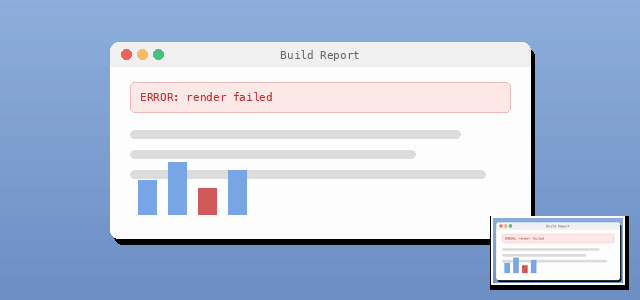

# Pasteport

<p align="center">
  
</p>

<p align="center">
  <a href="https://marketplace.visualstudio.com/items?itemName=chengww.pasteport"></a>
  <a href="https://open-vsx.org/extension/chengww/pasteport"></a>
</p>

<p align="center">
  <a href="../README.md">English</a> ·
  <a href="README.zh-CN.md">简体中文</a> ·
  <a href="README.zh-TW.md">繁體中文</a> ·
  <strong>日本語</strong>
</p>

VS Code の**リモートウィンドウ**のターミナルで貼り付けキーを押すと、ローカルのクリップボードにある画像や
ファイルがリモートホストへ送られ、その**リモートパス**がプロンプトに入力されます。CLI エージェントが
そのまま読み取れる状態です。

```
$ /tmp/pasteport/9f2c1a4b7e0d3856/clipboard.png
  └── 貼り付けキーを押して現れたもの
```

<p align="center">
  
</p>

ローカルウィンドウでは何も変わりません。キー入力はそのままターミナルへ渡されるので、キーバインドは
どこでもそのままにしておけます。

## 扱えるもの

| クリップボードの内容                                | 結果                                                |
| --------------------------------------------------- | --------------------------------------------------- |
| スクリーンショットやコピーした画像                  | PNG として一時保存し、アップロードしてパスを挿入    |
| ファイルマネージャーでコピーした 1 つ以上のファイル | 元の名前でアップロードし、各パスを挿入              |
| テキスト、空のクリップボード、コピーしたフォルダー  | 何もしません — 通常のターミナルの貼り付けが動きます |

複数のファイルは空白区切りで挿入され、末尾にも空白が付くのでそのまま入力を続けられます。

## 必要なもの

- **macOS、Windows または Linux のクライアント。** 拡張機能はあなたのローカルマシンで動き、そこでネイティブ
  のクリップボードを読みます。プラットフォームごとに別のリーダーがあり、実機で検証済みのものは
  [プラットフォーム対応](#プラットフォーム対応)を参照してください。
- **Linux のみ、クリップボードツールが必要:** Wayland なら `wl-clipboard`、X11 なら `xclip`。どちらも同梱して
  いません。無い場合は最初の貼り付けでインストールを提案します。実行するコマンドを先に提示し、認証は
  デスクトップ自身の polkit プロンプトが求めます。断れば、そのコマンドは自分で実行する形になります。
- **VS Code 1.85 以降**と、リモートウィンドウ（ローカルウィンドウは対象のシナリオではありません）。
- リモートホストへのインストールは不要です。

## リモートバックエンド

転送は VS Code がすでに張っている接続を通ります。`workspace.fs` を使い、ウィンドウ自身が持つ URI を借りる
形です。スキームと authority をそのまま受け継ぐので、どのバックエンドも同じコードパスを通り、バックエンド
ごとのロジックを保守する必要はありません。

| バックエンド         | 状態                   |
| -------------------- | ---------------------- |
| Remote - SSH         | 端から端まで検証済み   |
| Dev Containers       | 動作するはずだが未検証 |
| WSL                  | 動作するはずだが未検証 |
| Tunnels / Codespaces | 動作するはずだが未検証 |

未検証の行は言葉どおりです。コードパスは同一ですが、計測して実際に使ったのは SSH だけです。他の
バックエンドからの報告は歓迎します。

## しくみ

拡張機能は `"extensionKind": ["ui"]` を宣言しています。つまりリモートホストではなく、あなたのマシンの
**ローカル**拡張ホストで動きます。そこから 2 つの帰結があり、それがこの設計の理由です。

- **本物のクリップボードを読む。** Finder やエクスプローラーでコピーしたファイルは、クリップボード上では
  file URL として現れます。これは webview の非同期クリップボード API が決して見せない形式です。ネイティブ
  のクリップボードを直接読むことが、「ファイルをコピーしてターミナルに貼る」を成立させています。
- **バイトは 1 ホップで済む。** ファイルをローカルディスクから読み、VS Code の既存のチャネルで書き出します。
  RPC 境界をまたぐ base64 の往復がないので、途中で膨らみません。残る唯一の上限はメモリです。
  `workspace.fs.writeFile` はバッファを受け取るため、送信中は各ファイルが拡張ホストに保持されます。
  スクリーンショットやアーカイブには影響しません。数 GB のファイルはこの拡張機能の用途ではありません。

クリップボードの読み取りは、プレーンテキストの貼り付けを含めて毎回走るため、そのコストは入力の遅れとして
体感されます。macOS では `osascript` (JXA) から AppKit を呼び出す処理で、実測約 **30ms** — キー入力が
遅いと感じ始める閾値より下です。もし 150ms を超えたら拡張機能は警告を記録します。そこがリーダーを常駐
プロセスにすべき分岐点だからです。

### なぜ scp を使わないのか

開発に使った回線での実測値:

| データ量 | `workspace.fs` 経由 | ローカル基準 (`file:`) |
| -------- | ------------------- | ---------------------- |
| 1 MB     | 268ms (3.7 MB/s)    | —                      |
| 8 MB     | 2315ms (3.5 MB/s)   | 10ms (800 MB/s)        |

ローカルの 800 MB/s に対して 3.5 MB/s という差は、上限が API ではなくネットワーク回線にあることを示します。
scp も同じ回線を通り同じ上限を継ぎますから、加えても速度は買えません。増えるのはホスト名の解決、鍵と
エージェントの扱い、`ProxyJump` への対応、そして保守すべき接続のライフサイクルだけです。転送手段は
`workspace.fs` ひとつで、その結果として Dev Containers、WSL、Tunnels も無償で付いてきます。

### 重複排除

ファイルは `<remoteDir>/<fingerprint>/<元の名前>` に置かれます。アップロードの前に `stat` 1 回で対象を
確認し、すでに正しいサイズで存在すれば何も転送せず、既存のパスを挿入します。同じスクリーンショットを
2 度目に貼るコストは 1 往復です。

フィンガープリントは 8 MB までは内容のハッシュ (SHA-256)、それを超えると `size:mtime:name` です。数百 MB
をハッシュする費用は、それで消せる衝突のリスクより大きくなります。

### 進捗とキャンセル

転送のたびに、最初の 1 ミリ秒からステータスバーにスピナーが出ます。その役目は「止まっていないか」に
答えることだけです。完了の本当の合図は、パスがプロンプトに現れることです。

`pasteport.confirmAboveSeconds` (既定 5 秒) を超えると見積もられた転送は、先に確認を取り、そのあと進捗は
キャンセルボタン付きの通知に移ります。見積もりはあなたの回線で実測したスループットから出るので、バイト数を
当てるのではなく閾値のほうが適応します。コマンド `Pasteport: Cancel Transfer` はいつでも使えます。

### 後片付け

アップロードしたファイルとローカルに一時保存した画像は、`pasteport.ttlHours` (既定 24 時間) を過ぎると
起動時にバックグラウンドで削除されます。`Pasteport: Clean Up Remote Files` で即座に実行もできます。

クリップボードから取り出した画像は、OS の一時ディレクトリの下にある `pasteport-staging`
フォルダに一時保存されます。Linux ではそこが共有の `/tmp` であるため、フォルダ名に uid が
付き、`0700` で作成されます。共有マシンの他の利用者が中身を読むことはできません。
`Pasteport: Diagnose` が正確なパスを表示します。

削除の対象は、拡張機能自身のフィンガープリント形式 (16 桁の 16 進数) に一致する名前のディレクトリと、自身の
命名規則に一致する一時画像だけです。`remoteDir` の下のそれ以外は数えるだけで手を付けないので、この設定を
共有ディレクトリに向けても後片付けが巻き添えの被害になることはありません。

## コマンド

| コマンド                                | 内容                                             |
| --------------------------------------- | ------------------------------------------------ |
| `Pasteport: Paste into Remote Terminal` | キーバインドの対象。手動でも実行できます         |
| `Pasteport: Cancel Transfer`            | 進行中の転送を中止します                         |
| `Pasteport: Clean Up Remote Files`      | TTL による削除をすぐに実行します                 |
| `Pasteport: Diagnose`                   | 環境とクリップボードの検査結果をログに出力します |

うまく動かないときは `Pasteport: Diagnose` を実行してください。貼り付けの成功が依存する条件をすべて報告する
ので、バグ報告がずっと扱いやすくなります。

## 設定

| 設定                            | 既定値  | 説明                                                       |
| ------------------------------- | ------- | ---------------------------------------------------------- |
| `pasteport.remoteDir`           | _(空)_  | リモートホスト上の絶対 POSIX ディレクトリ。空なら自動検出  |
| `pasteport.quoting`             | `auto`  | `auto`、`shell` (特殊文字を引用) または `none` (そのまま)  |
| `pasteport.trailingSpace`       | `true`  | 挿入したパスの後ろに空白を追加                             |
| `pasteport.confirmAboveSeconds` | `5`     | 見積もりがこの秒数を超える転送は先に確認。`0` で確認しない |
| `pasteport.ttlHours`            | `24`    | 貼り付けたファイルを片付けるまでの時間。`0` で無効         |
| `pasteport.bracketedPaste`      | `false` | 挿入をブラケットペーストのマーカーで囲む                   |

`pasteport.remoteDir` はユーザー設定であり、他のユーザー設定と同様に、開いているワークスペースから上書きできます。値はあなたのターミナルに書き込まれるため、クローンしたリポジトリが貼り付け先を決めることもできます — 信頼できるワークスペースでのみ貼り付けてください。
`~` は展開されません — `workspace.fs` はそれを解決しないため、文字どおり `~` という名前のディレクトリが
できてしまいます。

### ファイルが置かれる場所

空のままなら、`pasteport.remoteDir` は `/tmp` と決め打ちせずリモートホストから解決します。ホストが `TMPDIR`
を別の場所へ向ける権利は当然あり、エージェントに読ませる使い捨てのファイルは、そのホストが使い捨てファイル
の置き場所だと言う場所に属します。

拡張機能にはリモート側でコマンドを実行する手段がありません — ローカル拡張ホストに住んでいるからです。持って
いるのは `workspace.fs` で、その読み取りはリモートのサーバープロセスが処理します。したがって
`/proc/self/environ` はそのプロセス自身の環境です。サーバーはあなたのログイン環境から起動されているので、
その `TMPDIR` こそホストが実際に設定した値です。解決の順序:

1. リモートサーバーの環境の `TMPDIR`、次に `TMP`、次に `TEMP` — Linux のリモート、つまり Linux への SSH、
   Dev Containers、WSL、Tunnels、Codespaces が該当します。
2. `/tmp` と `/var/tmp` のうち最初に存在するもの — procfs のないリモート、たとえば macOS の経路です。
3. `/tmp`。あわせてログに警告を残します。

そのうえでファイルは、選ばれた場所の `pasteport` サブディレクトリに置かれ、書き込みも削除もそのサブ
ディレクトリだけを対象にします。結果はホストごとに 1 度ログに残り、`Pasteport: Diagnose` も報告するので、
貼り付けがどこへ行ったのか分からなくなることはありません。値を明示すれば検出は完全に省かれます。

これで解決しないことが 2 つあります。他人と共有するリモートホストでは `TMPDIR` はたいてい `/tmp` のままな
ので、`/tmp/pasteport` は最初に貼り付けた人のものになり、次の利用者は権限エラーになります —
`pasteport.remoteDir` を自分の場所、たとえばホームディレクトリの下に設定してください。もう 1 つ、検出は
リモートが POSIX であることを前提にします。対応しているバックエンドはすべて Linux か macOS で、Windows の
リモートはこのどの部分も理解しないパス形式を必要とします。

`quoting` について: 想定している相手は入力をそのままのテキストとして扱う TUI エージェントで、そこでは引用符
がパスの一部になり、黙ってパスを壊します。そのため `auto` は現在パスをそのまま挿入します。行を解釈する
シェルに貼ることが主なら `shell` を選んでください。

## キーバインド

各プラットフォーム自身のターミナル貼り付けキーを使い、ターミナルにフォーカスがあるときだけ働きます。
クリップボードに画像やファイルが無ければ、そのキーはこれまでどおりに動きます。

| プラットフォーム | キー                                          | 備考                                                                                                             |
| ---------------- | --------------------------------------------- | ---------------------------------------------------------------------------------------------------------------- |
| macOS            | <kbd>Cmd</kbd>+<kbd>V</kbd>                   | —                                                                                                                |
| Windows          | <kbd>Ctrl</kbd>+<kbd>V</kbd>                  | —                                                                                                                |
| Linux            | <kbd>Ctrl</kbd>+<kbd>Shift</kbd>+<kbd>V</kbd> | ターミナルの慣習に合わせています。<kbd>Ctrl</kbd>+<kbd>V</kbd> は readline の `quoted-insert` なのでそのままです |

Windows と Linux では、フォーカスのあるターミナルで押されたキーは通常そのままシェルへ送られるため、
`pasteport.paste` を `terminal.integrated.commandsToSkipShell` に追加しています。このリストは VS Code の
組み込みリストに加算されるので、いま頼っているものは何も変わりません。設定ファイルに自分の
`commandsToSkipShell` 配列がある場合は既定値を置き換えてしまうので、拡張機能が一度だけ項目の追加を
提案します。

別のキーを使いたい場合は、キーボードショートカットで `pasteport.paste` を割り当て直してください。

## プラットフォーム対応

3 つのリーダーは、小さな JSON の約束以外に共通コードを持たない別々のプログラムです。プラットフォームの
API 自体にも共通点がないからです。

| クライアント | リーダー                                    | 状態                                                                     |
| ------------ | ------------------------------------------- | ------------------------------------------------------------------------ |
| macOS        | `osascript` (JXA) から AppKit               | 実機で検証済み: スクリーンショット、TIFF のみのコピー、Finder のファイル |
| Windows      | `powershell -STA` から System.Windows.Forms | Windows ランナーの CI で実行。実機のデスクトップでは未検証               |
| Linux        | `wl-paste` (Wayland) / `xclip` (X11)        | 形式の扱いは単体テスト済み。実機のデスクトップでは未検証                 |

正直に未計測な点が 2 つあります。PowerShell の起動は `osascript` より一桁遅く、そのコストは毎回の貼り付けに
乗ります。拡張機能は 150ms を超えると警告を記録するので、Windows で入力が重く感じるならログがそう言い、
そのときはリーダーを常駐プロセスにする必要があります。そして Windows も Linux のリーダーも、実機のデスクトップ
セッションで人間が動かしたことはまだありません — 報告を歓迎します。

## 貢献

[CONTRIBUTING.md](../CONTRIBUTING.md) を参照してください。`Pasteport: Diagnose` の出力を添えたバグ報告が
もっとも役に立ちます。

## ライセンス

[MIT](../LICENSE)
